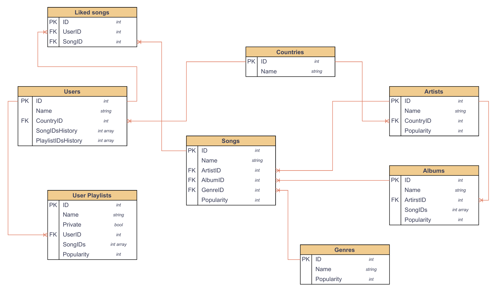

# Music-database
База данных для сервиса потоковой передачи музыки.

Ниже приведены схемы БД для разного уровня абстракции. В файле `database_demo.ipynb` показано как воспользоваться БД, наглядно описывается ее структура и привидены примеры запросов к ней.

Concept diagram:

Logic diagram:

## Dependencies
Ноутбук с демонстрацией БД использует библиотеки [`Pandas`](https://pandas.pydata.org), [`Matplotlib`](https://matplotlib.org), [`Psycopg`](https://www.psycopg.org/) и [`SQLAlchemy`](https://www.sqlalchemy.org/).
